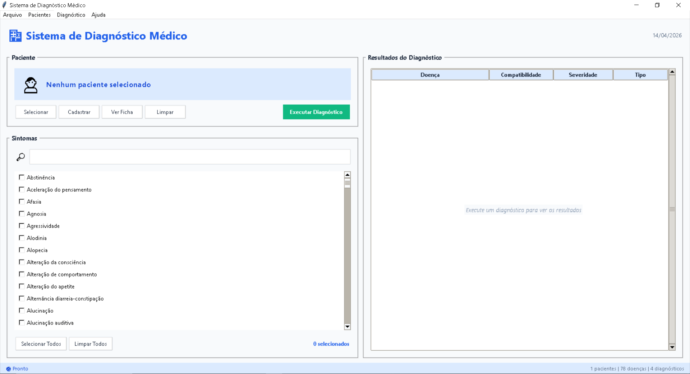
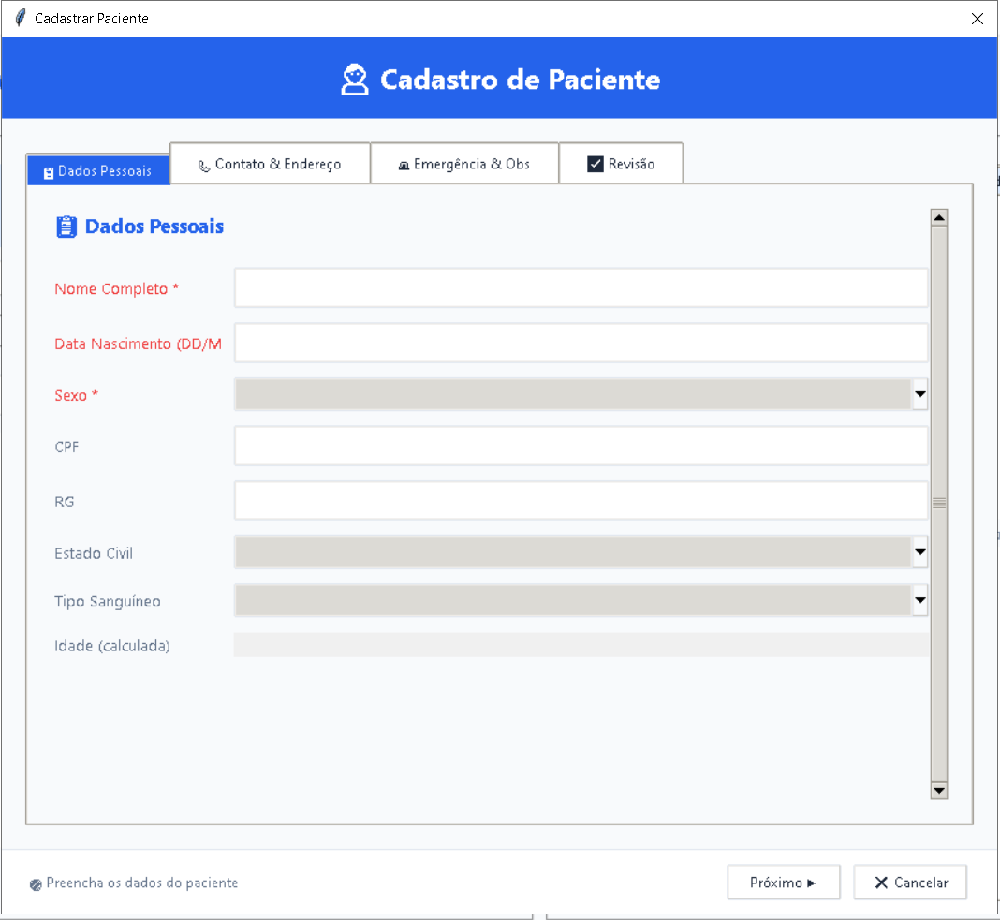
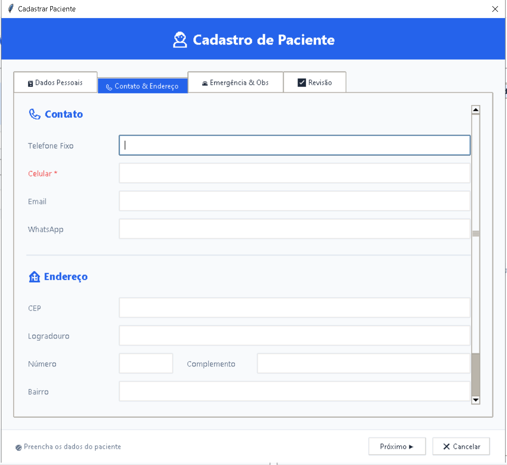
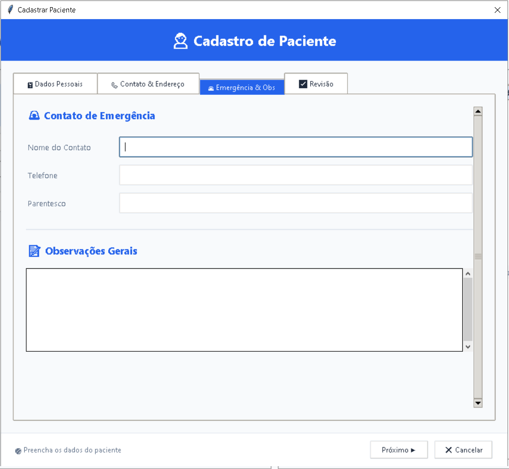
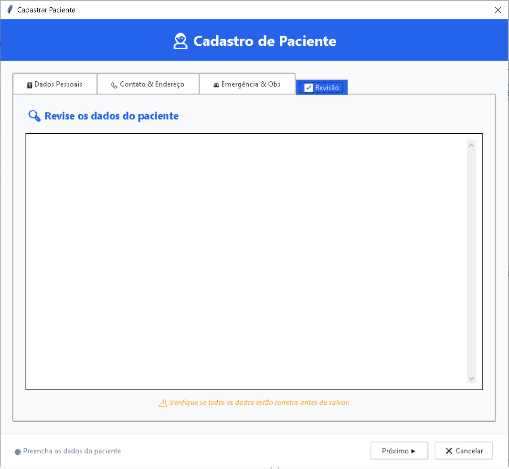
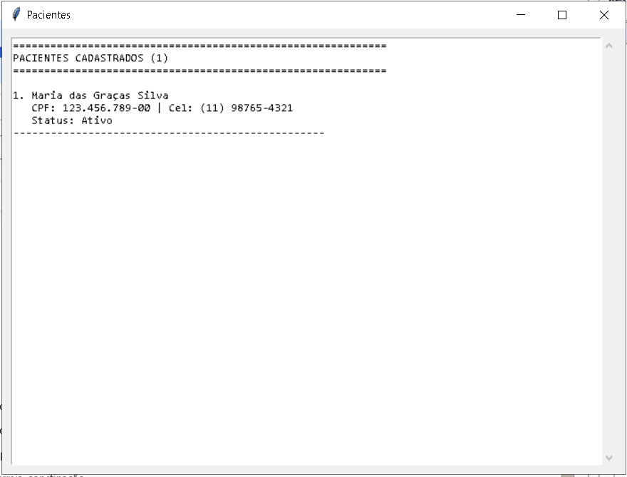
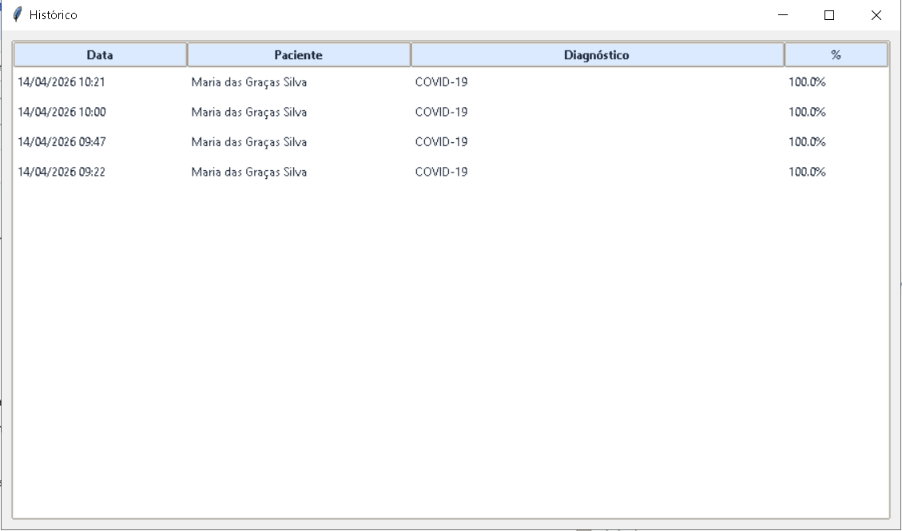

# Medical Diagnosis Support System

# Sistema de Diagnóstico Médico


---

## 🇧🇷 Português

Aplicação desktop para **auxílio diagnóstico baseado em sintomas**, com gerenciamento de pacientes, histórico clínico e exportação de relatórios. Desenvolvido em Python com interface gráfica utilizando Tkinter.

> Aviso: Esta ferramenta possui finalidade educacional e de apoio. Não substitui avaliação médica profissional.

---

### Funcionalidades

* Cadastro de pacientes com validação de CPF, e-mail e telefone
* Base com mais de 500 sintomas físicos e mentais
* Motor de diagnóstico com pesos, sintomas obrigatórios e cálculo de compatibilidade
* Histórico completo por paciente
* Exportação de relatórios em formato TXT
* Interface organizada em abas com suporte a atalhos
* Sistema de cache e backup automático

---

### Capturas de Tela

#### Tela principal



#### Cadastro de paciente

| Dados Pessoais                               | Contato e Endereço                    | Emergência e Observações                 | Revisão                               |
| -------------------------------------------- | ------------------------------------- | ---------------------------------------- | ------------------------------------- |
|  |  |  |  |

#### Lista de pacientes



#### Histórico



---

### Como Executar

#### Pré-requisitos

* Python 3.10 ou superior
* Nenhuma dependência externa

#### Instalação

```bash id="pt1"
git clone https://github.com/seu-usuario/sistema-diagnostico-medico.git
cd sistema-diagnostico-medico
```

#### Execução

```bash id="pt2"
python main.py
```

O arquivo `sintomas.json` deve estar presente na raiz do projeto.

---

### Estrutura do Projeto

```id="pt3"
sistema-diagnostico-medico/
├── main.py
├── interface.py
├── engine.py
├── database.py
├── models.py
├── historico.py
├── export.py
├── utils.py
├── config.py
├── sintomas.json
├── screenshots/
└── README.md
```

---

### Tecnologias

* Python
* Tkinter
* JSON
* Threading
* Logging

---

## 🇺🇸 English

Desktop application for **symptom-based diagnostic support**, including patient management, clinical history tracking, and report export features. Built with Python and a Tkinter-based graphical interface.

> Disclaimer: This tool is intended for educational and support purposes only. It does not replace professional medical evaluation.

---

### Features

* Patient registration with CPF, email, and phone validation
* Database with over 500 physical and mental symptoms
* Diagnostic engine with weighted logic, required symptoms, and compatibility scoring
* Full diagnostic history per patient
* Report export (TXT format)
* Tab-based user interface with keyboard shortcuts
* Caching system and automatic backups

---

### Screenshots

#### Main interface


#### Patient registration

| Personal Data                          | Contact & Address                     | Emergency & Notes                       | Review                               |
| -------------------------------------- | ------------------------------------- | --------------------------------------- | ------------------------------------ |
|  |  |  |  |

#### Patient list


#### Diagnostic history


---

### Getting Started

#### Requirements

* Python 3.10 or higher
* No external dependencies required

#### Installation

```bash id="en1"
git clone https://github.com/seu-usuario/sistema-diagnostico-medico.git
cd sistema-diagnostico-medico
```

#### Run

```bash id="en2"
python main.py
```

Ensure the `sintomas.json` file is located in the project root directory.

---

### Project Structure

```id="en3"
sistema-diagnostico-medico/
├── main.py
├── interface.py
├── engine.py
├── database.py
├── models.py
├── historico.py
├── export.py
├── utils.py
├── config.py
├── sintomas.json
├── screenshots/
└── README.md
```

---

### Technologies

* Python
* Tkinter
* JSON
* Threading
* Logging

---

## License

This project is licensed under the MIT License. See the `LICENSE` file for details.

---

## Author

José Carlos Santos Morais
LinkedIn: [https://www.linkedin.com/in/josé-carlos-santos-morais-42b41526a](https://www.linkedin.com/in/josé-carlos-santos-morais-42b41526a)

---

## Contributions

Contributions are welcome:

1. Fork the repository
2. Create a feature branch
3. Commit your changes
4. Push to your branch
5. Open a Pull Request

---

## Final Notes

This project was developed with a focus on software architecture, desktop application design, and practical use of Python for real-world scenarios. The diagnostic base is inspired by public medical guidelines and should not be used for clinical decision-making.

---

